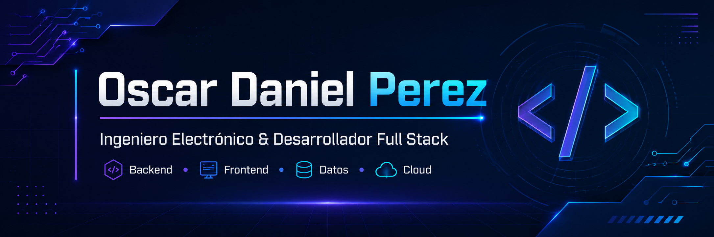

  

<h1 align="center">Oscar Daniel Perez</h1>

<h3 align="center">
Ingeniero Electrónico · Full Stack Developer · Backend Developer · Data Engineer
</h3>

Construyo aplicaciones web, APIs, integraciones empresariales y arquitecturas de datos con enfoque en seguridad, escalabilidad, rendimiento y valor real para negocio.

  
  
  

  

---

## ⟡ Perfil profesional

Soy **Ingeniero Electrónico** y **Desarrollador Full Stack**, con enfoque en **backend, frontend, datos, cloud e integración de sistemas**.

Mi trabajo se centra en construir soluciones reales: aplicaciones empresariales, APIs robustas, dashboards administrativos, automatizaciones, integraciones con sistemas externos, pipelines de datos y despliegues preparados para entornos productivos.

Trabajo principalmente con **Node.js, NestJS, Angular, React, PostgreSQL, SQL Server, Prisma, AWS y Azure**.

---

## ⟠ Propuesta técnica

<table>
  <tr>
    <td width="50%">
      <h3>Backend Engineering</h3>
      

        Diseño APIs REST, módulos backend, autenticación, autorización, validaciones de negocio, manejo centralizado de errores, servicios escalables e integraciones entre sistemas.
      

      

        <strong>Node.js · NestJS · Express · TypeScript · JWT · REST APIs</strong>
      

    </td>
    <td width="50%">
      <h3>Frontend Engineering</h3>
      

        Construyo interfaces web funcionales, paneles administrativos, flujos de usuario, formularios, dashboards y componentes conectados a APIs reales.
      

      

        <strong>Angular · React · Vite · HTML · CSS · Bootstrap</strong>
      

    </td>
  </tr>
  <tr>
    <td width="50%">
      <h3>Data Engineering</h3>
      

        Diseño procesos de ingesta, transformación, automatización y consulta de datos para reporting, analítica y toma de decisiones.
      

      

        <strong>Python · PySpark · AWS Lambda · Step Functions · Athena · Glue · Iceberg</strong>
      

    </td>
    <td width="50%">
      <h3>Cloud & Production</h3>
      

        Trabajo con despliegues, variables de entorno, servidores, reverse proxy, seguridad, documentación operativa y soporte a entornos productivos.
      

      

        <strong>AWS · Azure · Docker · IIS · PM2 · GitHub Actions · Azure DevOps</strong>
      

    </td>
  </tr>
</table>

---

## ⟁ Proyectos públicos destacados

<table>
  <tr>
    <td width="50%">
      <h3>GESTOR DE PEDIDOS</h3>
      

        Sistema de gestión de órdenes con estructura modular, backend en NestJS y panel administrativo en React.
      

      

        Incluye estructura por aplicaciones, documentación técnica, seguridad, contrato de API y ejecución local.
      

      

        <strong>Stack:</strong> NestJS · React · TypeScript · APIs REST
      

    </td>
  </tr>
  <tr>
  </tr>
</table>

## ⌁ Proyectos empresariales y arquitectura

Además de mis repositorios públicos, he trabajado en proyectos y soluciones orientadas a escenarios reales de negocio.

### Capacity App

Sistema empresarial con autenticación,g roles, dashboards, reglas de negocio, integración con SQL Server y despliegue en servidor productivo.

**Enfoque técnico:** React, Vite, Node.js, SQL Server, JWT, IIS, PM2, variables de entorno, CORS, seguridad y operación productiva.

### Devoluciones

Plataforma para gestionar procesos de devolución, con flujo tipo wizard para clientes, panel administrativo, validaciones por producto, factura y causal, y backend preparado para reglas de negocio.

**Enfoque técnico:** NestJS, React, Vite, Prisma, PostgreSQL, MariaDB, JWT, Redis, arquitectura modular y despliegue.

### OMS → Shopify Integration

Integración empresarial entre OMS y Shopify para sincronizar productos, variantes, precios, inventario, colecciones y órdenes pagadas.

**Enfoque técnico:** NestJS, Shopify GraphQL Admin API, webhooks, idempotencia, sincronización y consistencia de datos.

---

## ⧉ Tech Stack

### Lenguajes

  
  
  
  
  

 

### Backend

  
  
  
  
  

 

### Frontend

  
  
  
  
  
  
  
  
  

 

### Bases de datos

  
  
  
  
  
  
  

 

### Cloud, DevOps y herramientas

  
  
  
  
  
  
  
  
  

---
## ◈ GitHub Analytics

  
  

---
## ⟡ Enfoque actual

- Arquitectura backend con **NestJS, Node.js y TypeScript**
- Seguridad en aplicaciones: **JWT, CORS, roles, permisos, validaciones y headers**
- Aplicaciones full stack con **Angular, React, PostgreSQL y Prisma**
- Despliegues productivos con **IIS, PM2, variables de entorno y reverse proxy**
- Arquitecturas cloud y datos con **AWS, Azure, Lambda, Step Functions, Athena e Iceberg**
- Documentación técnica clara para proyectos, equipos y entornos productivos
- Evolución de proyectos como **Devoluciones, Capacity, OMS y DanielUnfit**

---

## ⟐ Conectemos

  
  
  
  

---

## Contribution Snake

  <picture>
    <source media="(prefers-color-scheme: dark)" srcset="https://raw.githubusercontent.com/oscardperez26/oscardperez26/output/snake-dark.svg" />
    <source media="(prefers-color-scheme: light)" srcset="https://raw.githubusercontent.com/oscardperez26/oscardperez26/output/snake.svg" />
    
  </picture>

---

  <strong>“Construyendo soluciones reales con código, datos y arquitectura.”</strong>

